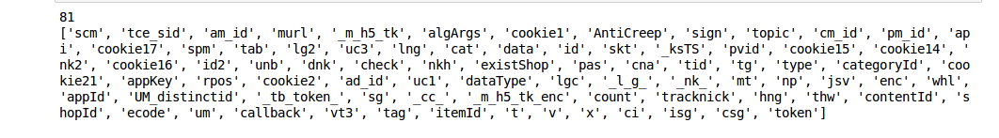

# py 正则表达式
### 提取wireshark包数据cookie_pair名

```python
import re
file = open("Documents/Report/wire/taobao_viewer_userB_1149pm.txt")
text = file.read()
print text
regex = r"\w*?(?==)"
pat = re.compile(regex)
arr = pat.findall(text)
print arr
brr = list(set(arr))
print brr
print len(brr)
if '' in brr:
    brr.remove('')
print len(brr)
print brr

```

